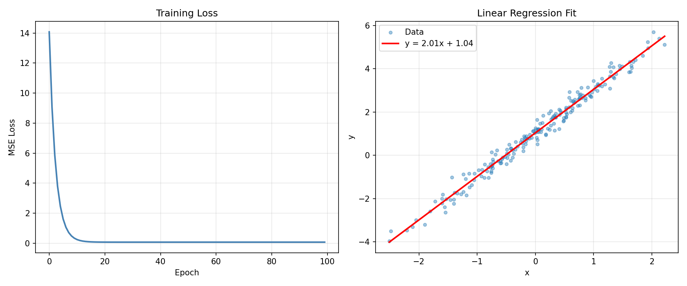
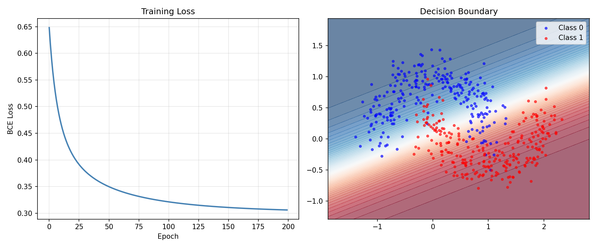
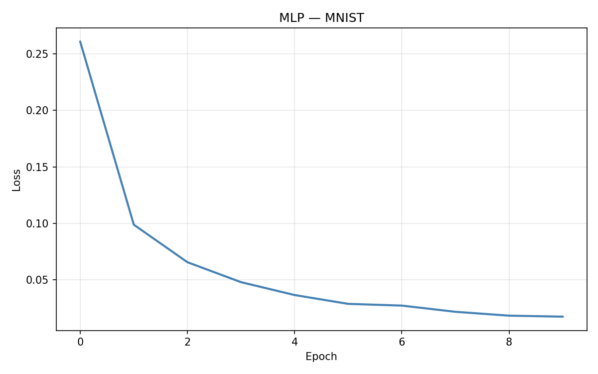
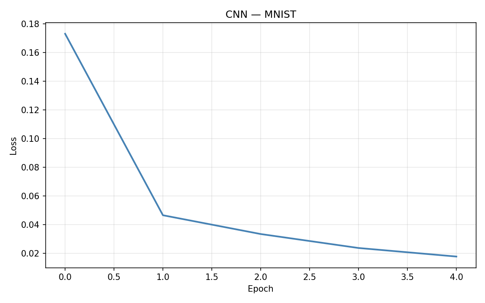
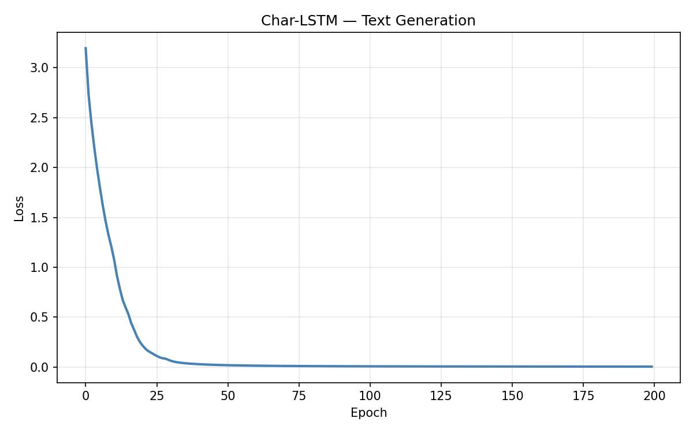
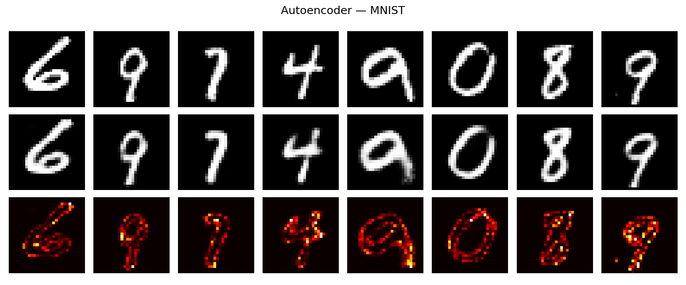
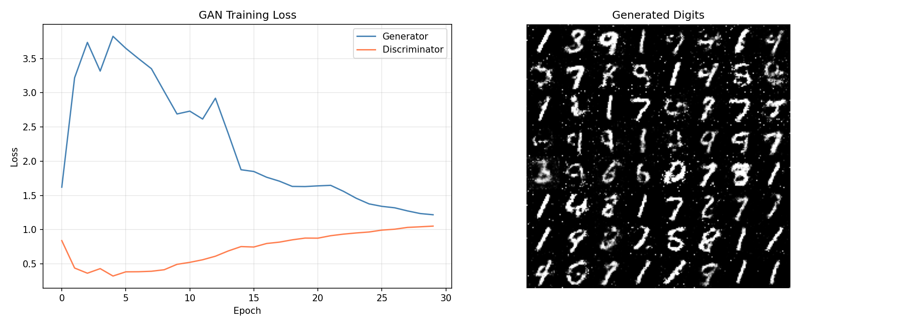
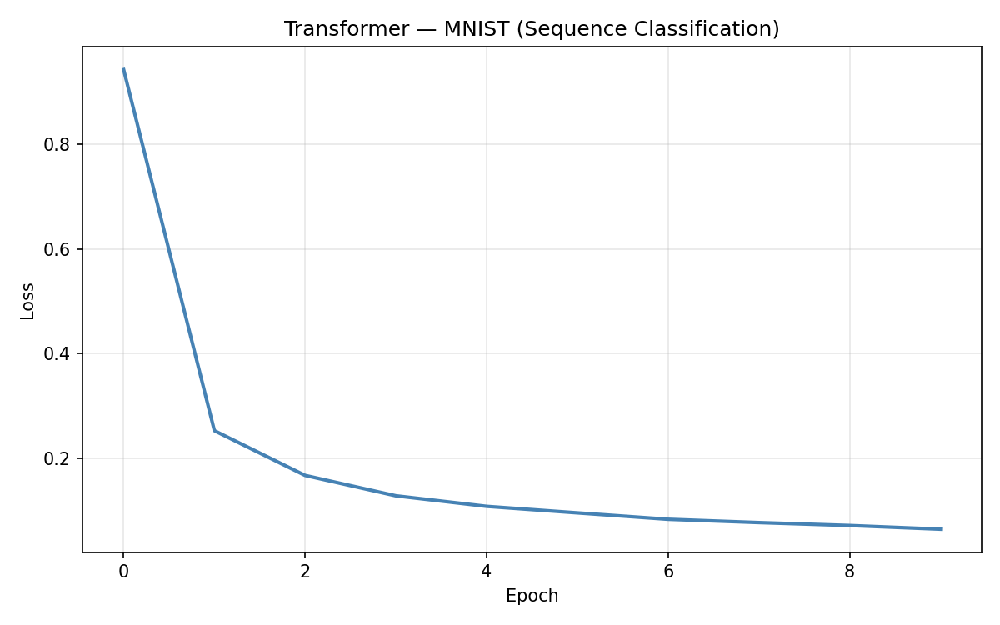

# pytorch-from-scratch

Learn PyTorch by building everything from Linear Regression to Transformers — 8 self-contained scripts, each under 100 lines of model code.

## Models

| # | Model | Dataset | Result |
|---|-------|---------|--------|
| 01 | Linear Regression | Synthetic (y=2x+1) | w=2.01, b=1.04 |
| 02 | Logistic Regression | Moons (2D) | 86.0% acc |
| 03 | MLP | MNIST | 97.8% acc |
| 04 | CNN | MNIST | 99.1% acc |
| 05 | RNN (LSTM) | Shakespeare (char-level) | Text generation |
| 06 | Autoencoder | MNIST | Reconstruction |
| 07 | GAN | MNIST | Digit generation |
| 08 | Transformer | MNIST (seq) | 97.7% acc |

## Results

### 01 — Linear Regression


### 02 — Logistic Regression


### 03 — MLP (Multi-Layer Perceptron)


### 04 — CNN (Convolutional Neural Network)


### 05 — RNN / LSTM (Character-Level Text Generation)


### 06 — Autoencoder


### 07 — GAN (Generative Adversarial Network)


### 08 — Transformer


## Installation

```bash
pip install -r requirements.txt
```

**Requirements:** Python 3.10+, PyTorch 2.0+, torchvision, matplotlib

## Usage

Train individual models:

```bash
python 01_linear_regression.py
python 02_logistic_regression.py
python 03_mlp.py
python 04_cnn.py
python 05_rnn.py
python 06_autoencoder.py
python 07_gan.py
python 08_transformer.py
```

Train all models sequentially:

```bash
python train_all.py
```

Plots are saved to `assets/`.

## Project Structure

```
pytorch-from-scratch/
├── common/
│   └── utils.py               # Seeding, plotting, device selection
├── 01_linear_regression.py    # Autograd basics, MSE loss
├── 02_logistic_regression.py  # Binary classification, BCE loss
├── 03_mlp.py                  # nn.Module, MNIST, cross-entropy
├── 04_cnn.py                  # Conv2d, MaxPool2d, feature maps
├── 05_rnn.py                  # LSTM, sequence modeling, text generation
├── 06_autoencoder.py          # Encoder-decoder, latent space
├── 07_gan.py                  # Generator vs Discriminator, adversarial training
├── 08_transformer.py          # Multi-head attention, positional encoding
├── train_all.py               # Run everything
└── assets/                    # Training result plots
```

## What You'll Learn

**01 Linear Regression** — How autograd works. Manual parameter updates with `torch.no_grad()`.

**02 Logistic Regression** — Binary cross-entropy, decision boundaries, sigmoid activation.

**03 MLP** — `nn.Module`, `nn.Linear`, ReLU, dropout. MNIST classification pipeline.

**04 CNN** — Convolution, pooling, feature hierarchy. Why CNNs dominate image tasks.

**05 RNN/LSTM** — Recurrent connections, hidden state, character-level language modeling.

**06 Autoencoder** — Unsupervised learning, bottleneck representation, reconstruction loss.

**07 GAN** — Adversarial training loop, generator/discriminator balance, mode collapse.

**08 Transformer** — Self-attention from scratch: Q/K/V projections, multi-head attention, positional embeddings, layer normalization.

## References

- [PyTorch Tutorials](https://pytorch.org/tutorials/)
- [Deep Learning (Goodfellow et al.)](https://www.deeplearningbook.org/)
- [Attention Is All You Need](https://arxiv.org/abs/1706.03762) (Transformer)
- [Generative Adversarial Networks](https://arxiv.org/abs/1406.2661) (GAN)

## License

MIT
